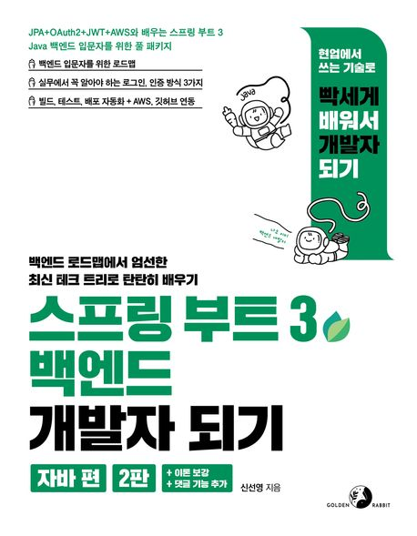

## 처음 공부하는 Spring boot

### 📁 Directory

##### basic
- Spring MVC와 같이 controller, service, domain 등의 큰 흐름 이해

##### blog
- 블로그를 제작하며 기본적인 CRUD 기능 구현 학습
- OneToMany Mapping 구현 학습
- Spring security 구현 학습
- JWT token 방식의 Spring security 구현 학습
- Google을 통해 OAuth2 인증 구현 학습

##### project
- blog에서 학습했던 것들을 복습하고 구현하고 싶은 것들을 추가로 구현해보며 blog 자체 제작
    - 중간에 Repository 분리
    <https://github.com/Properks/Blog_Project_Spring>

### 📝 공부 자료
